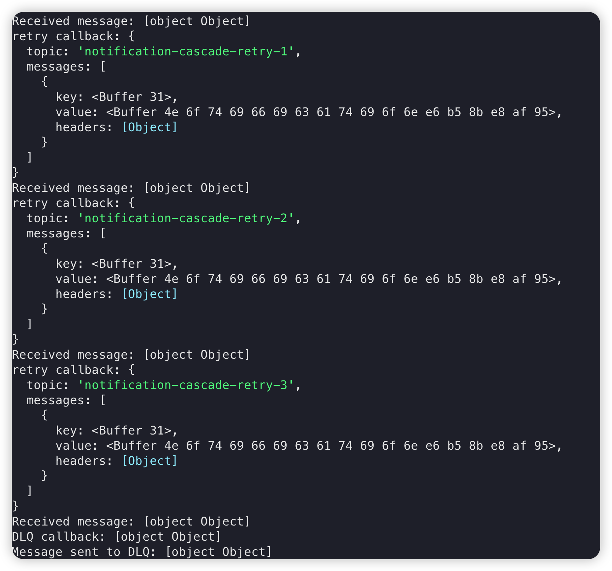

# kafka-retry
## Prerequisite
 * any kafka client

## Test for kafka-async-retry
  * node ./kafkajs-async-retry.js
  * test result with config retryDelays: [1, 2, 3]
  
## Test for kafka-cascade
  *  node ./cascade.js
  *  test result
  

## Diagram

